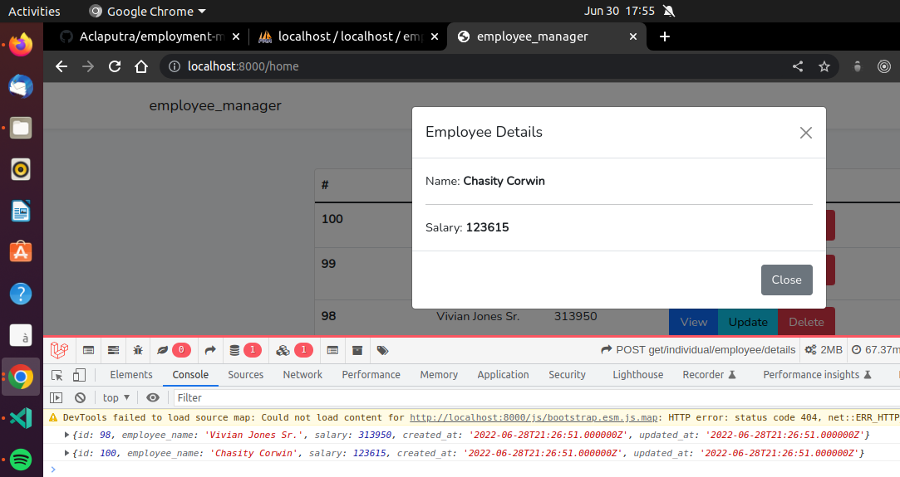
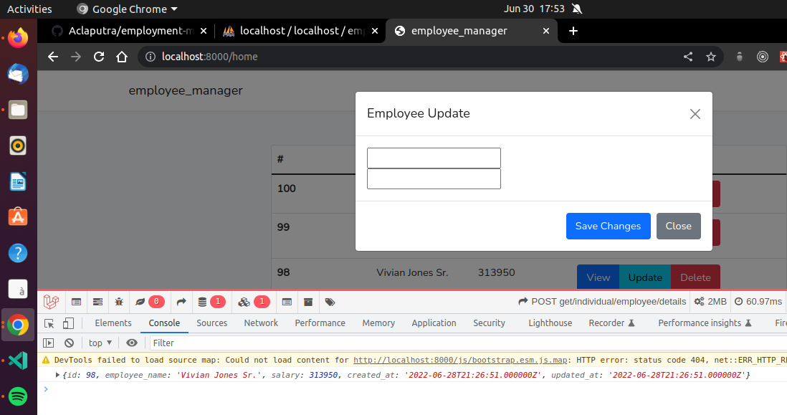

```
composer require laravel/ui

php artisan ui react

npm install && npm run dev

php artisan ui:auth

composer require barryvdh/laravel-debugbar
```
make Employee model, factory, migrate, & seed :
```
php artisan make:model Employee -mfs
```
in the migration file : 
```
    public function up()
    {
        Schema::create('employees', function (Blueprint $table) {
            $table->id();
            $table->string('employee_name');
            $table->integer('salary');
            $table->timestamps();
        });
    }
```
```
php artisan migrate
```
employee factory :
```
class EmployeeFactory extends Factory
{
    /**
     * Define the model's default state.
     *
     * @return array<string, mixed>
     */
    public function definition()
    {
        return [
            'employee_name' => $this->faker->name(),
            'salary'        => $this->faker->numberBetween(10000, 500000),
        ];
    }
}
```
employee seeder :
```
use App\Models\Employee;

class EmployeeSeeder extends Seeder
{
    /**
     * Run the database seeds.
     *
     * @return void
     */
    public function run()
    {
        Employee::factory(100)->create();
    }
}
```
Employee model :
```
class Employee extends Model
{
    use HasFactory;

    protected $fillable = [
        'employee_name',
        'salary'
    ];
}
```
DatabaseSeeder.pho :
```
class DatabaseSeeder extends Seeder
{
    /**
     * Seed the application's database.
     *
     * @return void
     */
    public function run()
    {
        $this->call(EmployeeSeeder::class);
    }
}
```
migrate the seeder :
```
php artisan migrate --seed
```
make Employee Controller :
```
php artisan make:controller EmployeesController
```
web.php :
```
Route::get('/get/employee/list', 
    [EmployeesController::class, 'getEmployeeList']
)->name('employee.list');
```
EmployeesController :
```
use Illuminate\Http\Request;
use Log;
use Exception;
use App\Models\Employee;

class EmployeesController extends Controller
{
    // Get Employee List from database.

    public function getEmployeeList() {
        try {
            $employees = Employee::all();
            return response()->json($employees);
        }
        catch(Exception $e) {
            Log::error($e);
        }
    }
}
```
Check if the axios api working :


Change to order by id descending :
```
    public function getEmployeeList() {
        try {
            $employees = Employee::orderBy('id', 'DESC')->get();
            return response()->json($employees);
        }
        catch(Exception $e) {
            Log::error($e);
        }
    }
}
```

now API Descended by Id :


create TableRow.jsx :
```
import React, { Component } from 'react'

export default class TableRow extends Component {

    constructor(props) {
        super(props);
    }

    render() {
        return (
            <tr>
                <th scope="row">{this.props.data.id}</th>
                <td>{this.props.data.employee_name}</td>
                <td>{this.props.data.salary}</td>
                <td>@mdo</td>
            </tr>
        )
    }
}

```
in Table.jsx :
```
import TableRow from './TableRow';

class Table extends Component {

    constructor(props) {
        super(props);

        this.state = {
            employees: []
        }
    }

    // Life cycle method
    componentDidMount() {
        // getEmployeeList require DOM nodes 
        this.getEmployeeList();
    }

    // Get Employee List.
    getEmployeeList = () => {
        let self = this;
        axios.get('/get/employee/list').then(function(response) {
            // console.log(response.data);
            self.setState({
                employees: response.data
            });
        });
    }

    render() {
        return (
            <div className="col-md-8 m-4">
                <div className="card">
                    {/* <div className="card-header">EmployeeApp Component</div>
                    <div className="card-body">I'm a EmployeeApp component!</div> */}
                    <table className="table">
                        <thead>
                            <tr>
                                <th scope="col" width="100px">#</th>
                                <th scope="col" width="100px">Name</th>
                                <th scope="col" width="100px">Salary</th>
                                <th scope="col" width="100px">Actions</th>
                            </tr>
                        </thead>
                        <tbody>
                            {this.state.employees.map(function(x, i) {
                                return <TableRow key={i} data={x} />
                            })}
                        </tbody>
                    </table>               
                </div>
            </div>
        );
    }
}
```
create TableActionsButtons.jsx :
```
import React, { Component } from 'react'
import ViewModal from '../modals/ViewModal'

export default class TableActionButtons extends Component {

  constructor(props) {
    super(props);
  }

  // Getting Individual employee data.

  getEmployeeDetails = (id) => {
    axios.post('/get/individual/employee/details', {
      employeeId: id
    }).then((response) => {
      console.log(response.data);
    })
  } 

  render() {
    return (
      <div className="btn-group" role="group">
        <button 
          className="btn btn-primary" 
          type="button"
          data-bs-toggle="modal" 
          data-bs-target="#exampleModal"
          onClick={ () => {this.getEmployeeDetails(this.props.eachRowId)}}
        >
          View
        </button>
        <ViewModal modalId={ this.props.eachRowId }/>

      </div>
    )
  }
}

```
add new function in EmployeesController.php for details:
```
    /**
     * Get Individual employee details.
     */
    public function getEmployeeDetails(Request $request) {
        try {
            $employeeData = Employee::findOrFail($request->get('employeeId'));
            return response()->json($employeeData);
        }
        catch(Exception $e) {
            Log::error($e);
        }
    }
```
api output after clicking view button it will get by id:


in TableActionButtons.jsx :

```
import ViewModal from '../modals/ViewModal'

export default class TableActionButtons extends Component {

  constructor(props) {
    super(props);

    this.state = {
      currentEmployeeName: null,
      currentEmployeeSalary: null
    }
  }

  // Getting Individual employee data.

  getEmployeeDetails = (id) => {
    axios.post('/get/individual/employee/details', {
      employeeId: id
    }).then((response) => {
      this.setState({
        currentEmployeeName: response.data.employee_name,
        currentEmployeeSalary: response.data.salary
      })
      console.log(response.data);
    })
  } 

  render() {
    return (
      <div className="btn-group" role="group">
        <button 
          className="btn btn-primary" 
          type="button"
          data-bs-toggle="modal" 
          data-bs-target={"#viewModal" + this.props.eachRowId}
          onClick={ () => {this.getEmployeeDetails(this.props.eachRowId)} }
        >
          View
        </button>
        <ViewModal modalId={ this.props.eachRowId } employeeData={ this.state }/>

        <button 
          className="btn btn-info" 
          type="button"
          data-bs-toggle="modal" 
          data-bs-target="#updateModal"
        >
          Update
        </button>

        <button 
          className="btn btn-danger" 
          type="button"
          data-bs-toggle="modal" 
          data-bs-target="#deleteModal"
        >
          Delete
        </button>

      </div>
    )
  }
}
```
ViewModel.jsx :
```
export default class ViewModal extends Component {

    constructor(props) {
        super(props);
    }

    render() {
        return (
            <div className="modal fade" id={"viewModal" + this.props.modalId} tabIndex="-1" aria-labelledby="exampleModalLabel" aria-hidden="true">
                <div className="modal-dialog">
                    <div className="modal-content">
                        <div className="modal-header">
                            <h5 className="modal-title" id="exampleModalLabel">Modal title</h5>
                            <button type="button" className="btn-close" data-bs-dismiss="modal" aria-label="Close"></button>
                            </div>
                            <div className="modal-body">
                                Name: <strong>{this.props.employeeData.currentEmployeeName}</strong>
                                <hr />
                                Salary: <strong>{this.props.employeeData.currentEmployeeSalary}</strong>
                            </div>
                            <div className="modal-footer">
                            <button type="button" className="btn btn-secondary" data-bs-dismiss="modal">Close</button>
                            <button type="button" className="btn btn-primary">Save changes</button>
                        </div>
                    </div>
                </div>
            </div>
        )
    }
}
```

output after fetch the data :



create New Button for Update modal :
```
import UpdateModal from '../modals/UpdateModal';

export default class TableActionButtons extends Component {

  constructor(props) {
    super(props);

    this.state = {
      currentEmployeeName: null,
      currentEmployeeSalary: null
    }
  }

  // Getting Individual employee data.

  getEmployeeDetails = (id) => {
    axios.post('/get/individual/employee/details', {
      employeeId: id
    }).then((response) => {
      this.setState({
        currentEmployeeName: response.data.employee_name,
        currentEmployeeSalary: response.data.salary
      })
      console.log(response.data);
    })
  } 

  render() {
    return (
      <div className="btn-group" role="group">
        <button 
          className="btn btn-primary" 
          type="button"
          data-bs-toggle="modal" 
          data-bs-target={"#viewModal" + this.props.eachRowId}
          onClick={ () => {this.getEmployeeDetails(this.props.eachRowId)} }
        >
          View
        </button>
        <ViewModal modalId={ this.props.eachRowId } employeeData={ this.state }/>

        <button 
          className="btn btn-info" 
          type="button"
          data-bs-toggle="modal" 
          data-bs-target={"#updateModal" + this.props.eachRowId}
          onClick={ () => {this.getEmployeeDetails(this.props.eachRowId)} }
        >
          Update
        </button>
        <UpdateModal modalId={ this.props.eachRowId } employeeData={ this.state }/>
```
create New UpdateModal.jsx file :
```
import React, { Component } from 'react'

export default class UpdateModal extends Component {

    constructor(props) {
        super(props);

        this.state = {
            employeeName: null,
            employeeSalary: null
        }
    }

    // Updating employee name state
    inputEmployeeName = (event) => {
        this.setState({
            employeeName: event.target.value,
        });
    }
    // Updating employee salary state.
    inputEmployeeSalary = (event) => {
        this.setState({
            employeeSalary: event.target.value,
        });
    }

    // update submit handler
    updateEmployeeData = () => {

    }

    render() {
        return (
            <div className="modal fade" id={"updateModal" + this.props.modalId} tabIndex="-1" aria-labelledby="exampleModalLabel" aria-hidden="true">
                <div className="modal-dialog">
                    <div className="modal-content">
                        <div className="modal-header">
                            <h5 className="modal-title" id="exampleModalLabel">Employee Details</h5>
                            <button type="button" className="btn-close" data-bs-dismiss="modal" aria-label="Close"></button>
                            </div>
                            <div className="modal-body">
                                <form className='form'>
                                    <div className="form-group">
                                        <input type="text" 
                                            id="employeeName" 
                                            value={this.state.employeeName ?? ""}
                                            onChange={this.inputEmployeeName}
                                        />
                                    </div>
                                    <div className="form-group">
                                        <input type="text" 
                                            id="employeeSalary" 
                                            value={this.state.employeeSalary ?? ""}
                                            onChange={this.inputEmployeeSalary}
                                        />
                                    </div>
                                </form>
                            </div>
                            <div className="modal-footer">
                            <input type="submit" 
                                value="Update"
                                onClick={this.updateEmployeeData}
                            />
                            <button type="button" className="btn btn-secondary" data-bs-dismiss="modal">Close</button>
                            <button type="button" className="btn btn-primary">Save changes</button>
                        </div>
                    </div>
                </div>
            </div>
        )
    }
}

```

output modal after clicked the update button:



```
export default class UpdateModal extends Component {

    constructor(props) {
        super(props);

        this.state = {
            employeeName: null,
            employeeSalary: null
        }
    }

    // Updating employee name state
    inputEmployeeName = (event) => {
        this.setState({
            employeeName: event.target.value,
        });
    }
    // Updating employee salary state.
    inputEmployeeSalary = (event) => {
        this.setState({
            employeeSalary: event.target.value,
        });
    }

    static getDerivedStateFromProps(props, current_state) {
        let employeeUpdate = {
            employeeName: null,
            employeeSalary: null,
        }

        if(current_state.employeeName !== props.employeeData.currentEmployeeName) {
            employeeUpdate.employeeName = props.employeeData.currentEmployeeName;
        }

        if(current_state.employeeSalary !== props.employeeData.currentEmployeeSalary) {
            employeeUpdate.employeeSalary = props.employeeData.currentEmployeeSalary;
        }

        return employeeUpdate;
    }
```
display update data :


modified getDerivedStateFromProps in UpdateModal.jsx :
```
    static getDerivedStateFromProps(props, current_state) {
        let employeeUpdate = {
            employeeName: null,
            employeeSalary: null,
        }

        // Updating data from input.
        if(current_state.employeeName && (current_state.employeeName !== props.employeeData.currentEmployeeName)) {
            return null;
        }

        // Updating data from props Below.
        if(current_state.employeeName !== props.employeeData.currentEmployeeName) {
            employeeUpdate.employeeName = props.employeeData.currentEmployeeName;
        }

        if(current_state.employeeSalary !== props.employeeData.currentEmployeeSalary) {
            employeeUpdate.employeeSalary = props.employeeData.currentEmployeeSalary;
        }

        return employeeUpdate;
    }
```
fix bug after double clicking the update button :
```
        // Updating data from props Below.
        if(current_state.employeeName !== props.employeeData.currentEmployeeName || 
            current_state.employeeName === props.employeeData.currentEmployeeName) {
            employeeUpdate.employeeName = props.employeeData.currentEmployeeName;
        }

        if(current_state.employeeSalary !== props.employeeData.currentEmployeeSalary || 
            current_state.employeeSalary === props.employeeData.currentEmployeeSalary) {
            employeeUpdate.employeeSalary = props.employeeData.currentEmployeeSalary;
        }

        return employeeUpdate;
```

now we can edit the input.


<!-- referenaces: (45:23/2:28:56) https://www.youtube.com/watch?v=svziC8BblM0&t=1255s&ab_channel=ZarxBiz-->